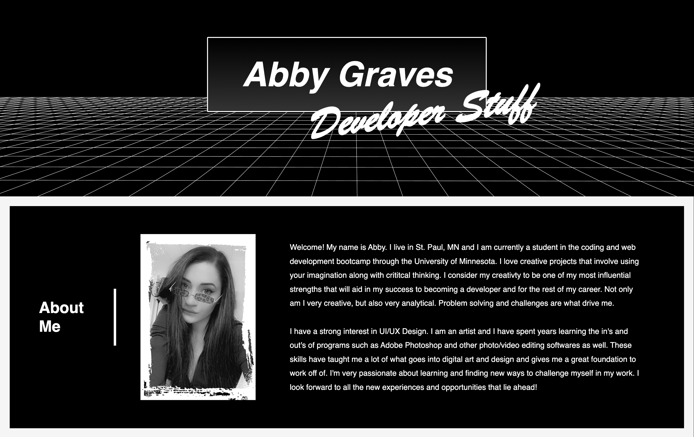

# Professional Portfolio


## **Description**
### My professional portfolio and resume &nbsp; • &nbsp; [Click Here to View my Portfolio](https://abbygraves.github.io/2-professional-portfolio/)

<br/>



<br/>

## **Built With:**
+ HTML
+ CSS 

<br/>

## **Development Overview**
+ Included a decriptpive `<title>` element
+ Created links that scroll to the corresponding section on the page when clicked
+ Provided images to show my work and made them clickable by using an `href=""` attribute 
+ Made the images that are linked to a depolyed application open in a <br/> new tab by using `target="_blank"`
+ Included `alt=""` attributes for the images to ensure accessibilty standards are met
+ Used an `<a>` tag which included an `href=""` attribute containing the `mailto:` parameter to open the user's default email client and autofill my email in the recipient field when my email, listed under the "Contact Me" section, is clicked
+ Included links to my personal profile on other websites, such as GitHub, in the "Contact Me" section 
+ Implemented advanced CSS techniques to acheive a clean and simple yet engaging webpage design 
+ Used media queries to create responsive layouts that adapt to the user's viewport

<br/>

## **License**
```
MIT License


Copyright (c) 2022 Abigail J. Graves

Permission is hereby granted, free of charge, to any person obtaining a copy
of this software and associated documentation files (the "Software"), to deal
in the Software without restriction, including without limitation the rights
to use, copy, modify, merge, publish, distribute, sublicense, and/or sell
copies of the Software, and to permit persons to whom the Software is
furnished to do so, subject to the following conditions:

The above copyright notice and this permission notice shall be included in all
copies or substantial portions of the Software.

THE SOFTWARE IS PROVIDED "AS IS", WITHOUT WARRANTY OF ANY KIND, EXPRESS OR
IMPLIED, INCLUDING BUT NOT LIMITED TO THE WARRANTIES OF MERCHANTABILITY,
FITNESS FOR A PARTICULAR PURPOSE AND NONINFRINGEMENT. IN NO EVENT SHALL THE
AUTHORS OR COPYRIGHT HOLDERS BE LIABLE FOR ANY CLAIM, DAMAGES OR OTHER
LIABILITY, WHETHER IN AN ACTION OF CONTRACT, TORT OR OTHERWISE, ARISING FROM,
OUT OF OR IN CONNECTION WITH THE SOFTWARE OR THE USE OR OTHER DEALINGS IN THE
SOFTWARE.
```

&nbsp;&nbsp;&nbsp; [https://choosealicense.com/licenses/mit](https://choosealicense.com/licenses/mit)
